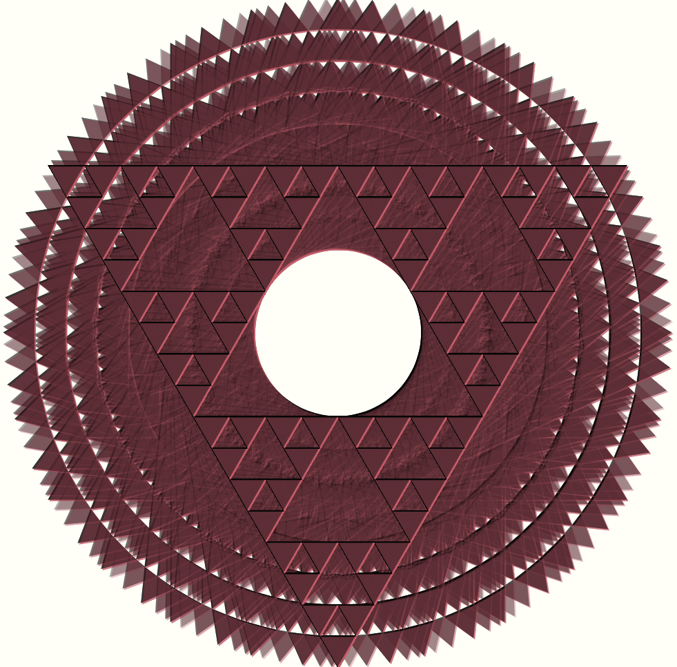

# Sierpiński triangle (rotating...)

This is my first exploration in generative art. I've made a [Sierpiński triangle](https://en.wikipedia.org/wiki/Sierpi%C5%84ski_trianglei), rotating...

## 'Stabilized' state

